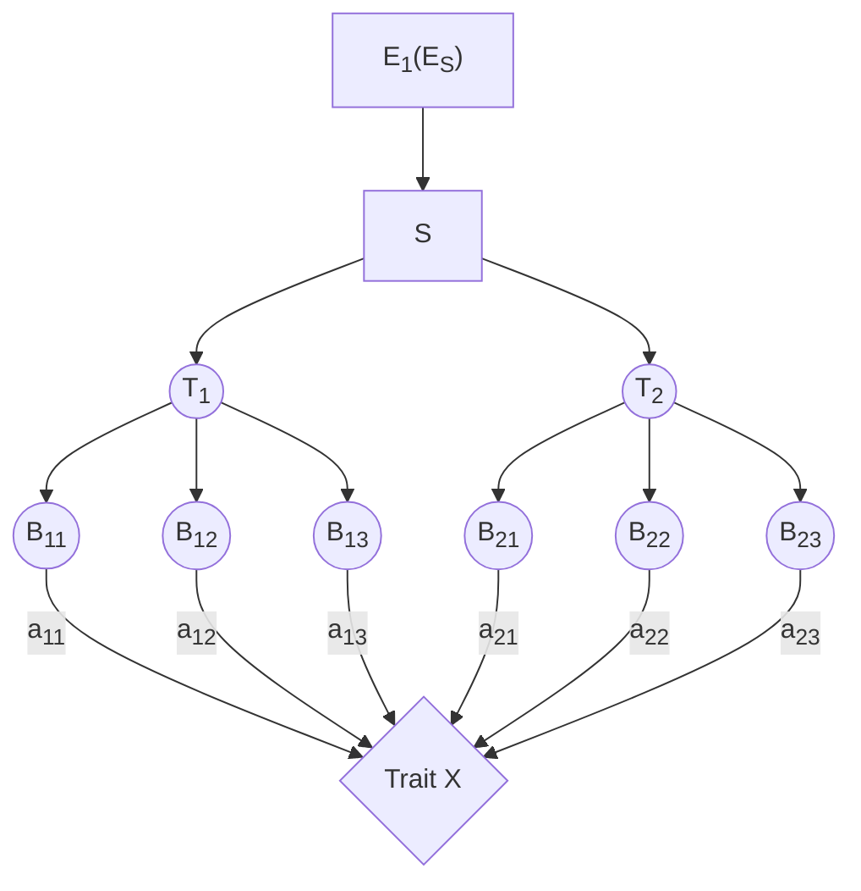

# 算法问题总结

## 问题的形式
考虑寻找以下的network

### Trait X连续时
输入为如下形式数据
$$
\begin{array}{c|cccc|c}
\text{样本编号}& \text{Maker 1}  & \text{Maker 2}& ...  & \text{Maker N} &\text{Trait X}\\
1  &  1  &  1  &  ...& 1&X_1\\
2  &  1  &  0  &  ...&0&X_2\\
...&...&...&...&...&...\\
m  &  0  &  1  & ... &1&X_m
 \end{array}
$$

寻找network的过程可以用如下流程表示

 1. 利用线性模型扫描
 2. sds
 3. 

### Trait X为二元变量中单一值时

$$
\begin{array}{c|cccc|c}
\text{样本编号}& \text{Maker 1}  & \text{Maker 2}& ...  & \text{Maker N} &\text{Trait X}\\
1  &  1  &  1  &  ...& 1&1\\
2  &  1  &  0  &  ...&0&1\\
...&...&...&...&...&...\\
m  &  0  &  1  & ... &1&m
 \end{array}
$$

> Written with [StackEdit](https://stackedit.io/).
<!--stackedit_data:
eyJoaXN0b3J5IjpbMTM5NDAwODc3MF19
-->