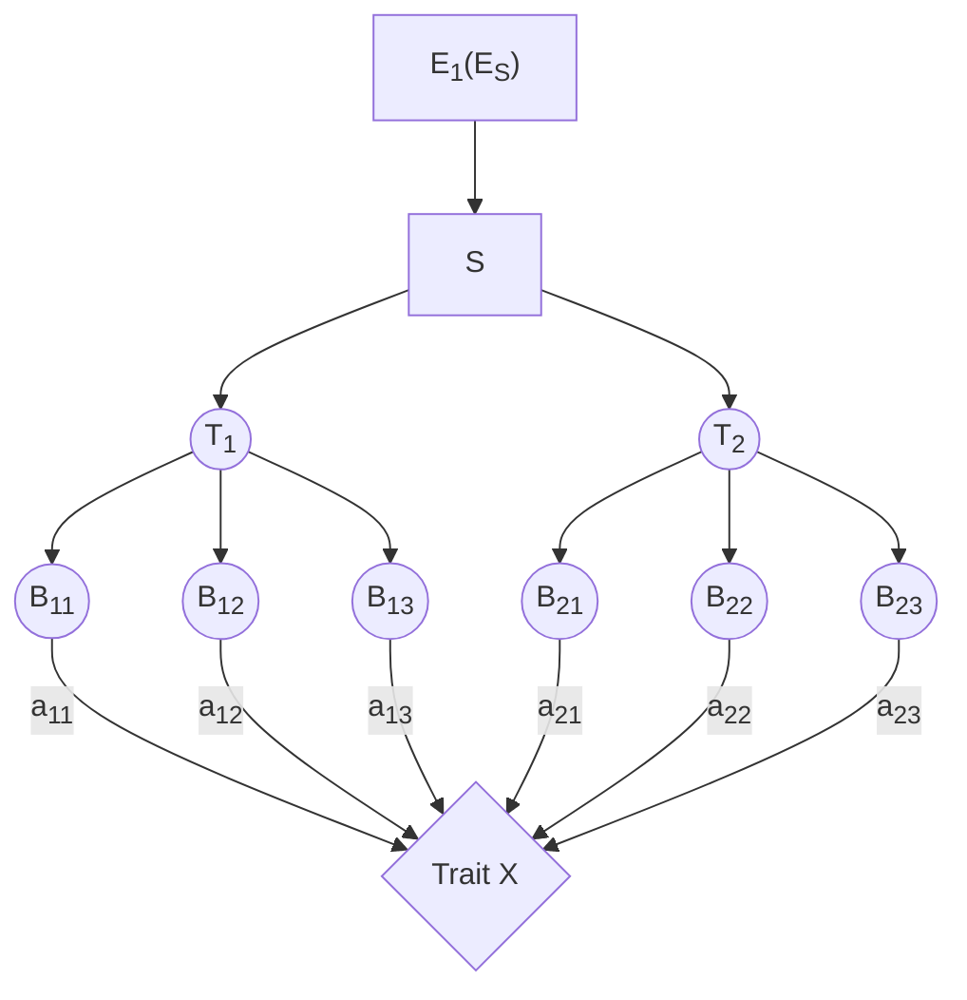

# 算法问题总结

## 问题的形式
考虑寻找以下的network

### Trait X连续时
输入为如下形式数据
$$
\begin{array}{c|cccc|c}
\text{样本编号}& \text{Maker 1}  & \text{Maker 2}& ...  & \text{Maker N} &\text{Trait X}\\
1  &  1  &  1  &  ...& 1&X_1\\
2  &  1  &  0  &  ...&0&X_2\\
...&...&...&...&...&...\\
m  &  0  &  1  & ... &1&X_m
 \end{array}
$$

寻找network的过程的文字材料表述如下：

 1. 对整个群体进行目标性状的主效QTL定位（SAS GLM过程）
 2. 按照主效QTL的效应大小进行分组（效应大小相近的QTL划分为一组），将检测到的QTL大致分为两到三组，分别代表遗传网络的不同层次，即上、（中、）下游位点；
 3. 检测各组内QTL间成对的互作。当检测到的两互作位点涉及的4种基因型值中的某一种（功能基因型）显著高于或低于其他3种基因型值（”contrast”命令或多重比较），且互作效应与二者的主效应相当时，可以将这两个位点视为遗传网络中的一个功能遗传单元（FGU），在两个位点上构成功能基因型的等位基因被视为功能等位基因；同理，由多个位点组成的FGU，各位点间都应该检测到pattern一致的成对互作；没有检测到互作的QTL，作为一个单独的FGU。
 4. 检测组间QTL之间成对的互作。当两互作位点表现为仅在上游位点的功能等位基因背景下，下游位点的两等位基因间有显著的基因型值差异，QTL参数表现为上游位点的效应大于下游位点，二者的互作效应与下游位点主效应相近，则可以推测这两个位点涉及到遗传网络中的同一个遗传途径，且存在上下游的层次关系。同理，当上下游FGU内涉及多个位点时，各位点间都应该检测到pattern一致的成对互作。途径效应的估计值是在上游位点功能的背景下，下游位点有功能的基因型值与无功能的基因型值之差。

结合交流，我的理解的过程中现在的问题包括：

 - 步骤1中QTL定位，是基于线性模型，$\text{Trait X}=\beta_0+\Sigma_i\beta_i\text{Maker}_i$一次计算得到所有$b_i$，还是做$N$次$\text{Trait X}=\beta_{i0}+\beta_i\text{Maker}_i$单变量一维估计？我的理解是后者
 - 步骤2中“主效QTL的效应大小”是指前一步中得到的$\beta_i$的大小吗？分成2组或者3组是否有可以量化的标准？
 - 步骤3中

### Trait X为二元变量中单一值时

$$
\begin{array}{c|cccc|c}
\text{样本编号}& \text{Maker 1}  & \text{Maker 2}& ...  & \text{Maker N} &\text{Trait X}\\
1  &  1  &  1  &  ...& 1&1\\
2  &  1  &  0  &  ...&0&1\\
...&...&...&...&...&...\\
m  &  0  &  1  & ... &1&m
 \end{array}
$$

> Written with [StackEdit](https://stackedit.io/).
<!--stackedit_data:
eyJoaXN0b3J5IjpbMTA3MjgyMTgzOF19
-->